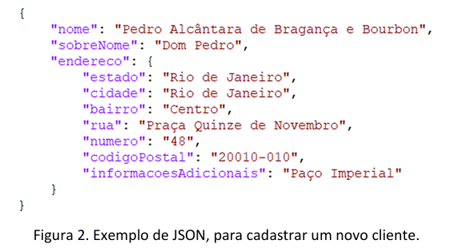

## Integração Front-End e Back-End RESTful
Micro-serviço Java (wbbackend.jar), CRUD, comunicação JSON com endpoints REST.
Repositório: https://github.com/gerson-pn/atviv-wb-typescript

Atividade prática ATVIV 
Professor Dr. Eng. Gerson Penha. 
Softwares e bibliotecas sugeridos: 
• VSCode. 
• TypeScript. 
• React 
• Java 
Contextualização: 
REST é uma sigla que significa “representational state transfer” (representação para transferência de estado). 
REST é um estilo de arquitetura, que estabelece um padrão de comunicação entre sistemas na web, ele 
facilita a comunicação entre os sistemas. Os sistemas compatíveis com REST, geralmente chamados de 
sistemas RESTful, são caracterizados por serem sem estado e separarem as preocupações (operações) do 
cliente e do servidor. 
No estilo arquitetural REST, a implementação do cliente e a implementação do servidor devem ser feitas de 
forma independente, sem que uma conheça a outra. Isso significa que o código do lado do cliente pode ser 
alterado a qualquer momento sem afetar a operação do servidor, e o código do lado do servidor pode ser 
alterado sem afetar a operação do cliente. Contanto que cada lado saiba qual formato de mensagens enviar 
para o outro eles podem ser mantidos modulares e separados. 
Separando as preocupações da interface do usuário das preocupações com o armazenamento de dados, 
melhora-se a flexibilidade da interface entre plataformas e a escalabilidade, simplificando os componentes do 
servidor. Além disso, a separação permite a cada componente a capacidade de evoluir de forma 
independente. 
Ao usar uma interface REST, diferentes clientes atingem os mesmos endpoints (locais, urls) REST, executam as 
mesmas ações e recebem as mesmas respostas. 
Os sistemas que seguem a arquitetura REST são sem estado (stateless), o que significa que o servidor não 
precisa saber nada sobre o estado em que o cliente está e vice-versa. Dessa forma, tanto o servidor quanto o 
cliente podem entender qualquer mensagem recebida, mesmo sem ver as mensagens anteriores. Essa 
restrição é imposta por meio do uso de recursos, em vez de comandos. Recursos são os substantivos da Web - 
eles descrevem qualquer objeto, documento ou coisa que você precise armazenar ou enviar para outros 
serviços. Isto ajuda os aplicativos RESTful a obter confiabilidade, desempenho rápido e escalabilidade, como 
componentes que podem ser gerenciados, atualizados e reutilizados sem afetar o sistema como um todo, 
mesmo durante a operação do sistema. 
Atividade: 
Após o desenvolvimento do pré-projeto para GUI do sistema, você obteve experiência em desenvolvimento 
front-end e melhorou, consideravelmente, seu conhecimento sobre HTML, CSS e bibliotecas para construção 
de interfaces gráficas na web. Mas, ainda lhe falta experiência sobre como funciona a comunicação entre 
front-end e back-end. 
Depois de conversar com a equipe de desenvolvimento, descobriu-se que há um pré-projeto para o back-end. 
Este pré-projeto seguiu a arquitetura REST, com um micro-serviço desenvolvido. O pré-projeto back-end está 
acessível no endereço https://github.com/gerson-pn/atviv-wb-typescript ou pela Figura 1. 
Figura 1. Código para auxiliar na atviv. 
O pré-projeto back-end não está completo. O micro-serviço possui, apenas, habilidade de listar, cadastrar, 
atualizar e excluir clientes, o que não abrange todas as funcionalidades do sistema, mas é suficiente para 
treinar habilidades de desenvolvimento e integração front-end e back-end. 
Outro ponto importante é a linguagem utilizada para o desenvolvimento do micro-serviço. Ele foi 
desenvolvido em Java. Isto aconteceu, porque, à época, existia um funcionário na empresa capacitado para 
esta tecnologia. Este funcionário não está mais no grupo e não pode ser contactado para suporte. Portanto, 
não se deseja continuar o projeto em Java, apenas usar o que está feito para treinamento e desenvolvimento 
da integração back-end e front-end. A arquitetura micro-serviços permite o desenvolvimento do front-end 
sem conhecimento da implementação back-end. 
Para acessar as informações do serviço deve-se conhecer suas rotas, seus end-points. O pré-projeto back-end 
possui os seguintes end-points, considerando a execução em máquina local: 
• http://localhost:32832/clientes - rota para acesso da lista de clientes. 
• http://localhost:32832/cliente/{id} - rota para acesso a um cliente específico, por id. 
• http://localhost:32832/cliente/cadastrar - rota para cadastrar um novo cliente. 
• http://localhost:32832/cliente/excluir - rota para excluir um cliente. 
• http://localhost:32832/cliente/atualizar - rota para atualizar um cliente. 
O micro-serviço segue parte dos critérios necessários para ser considerado uma aplicação RESTful e, portanto, 
a comunicação dele com um front-end deve ser a mais flexível possível. Assim, todo o tráfego de dados entre 
o micro-serviço e o front-end acontece através da passagem de objetos do tipo JSON. Por exemplo, para 
cadastrar um novo cliente deve-se enviar ao back-end um JSON, semelhante ao apresentado na Figura 2. 

Talvez o código disponível no repositório do pré-projeto back-end seja prolixo. Mas não há necessidade do 
seu entendimento. No mesmo repositório há um aplicativo executável, que disponibiliza todo o back-end 
montado, com suas rotas e, inclusive, um banco de dados pronto, que funciona em memória. O nome do 
aplicativo executável é “wbbackend.jar”. Este arquivo está disponível na pasta chamada de “executável”. 
O executável é capaz de “levantar” toda a aplicação back-end, de uma vez só, mas para isso é necessário 
utilizar a máquina virtual Java, para execução. Isto é feito através do comando: “java -jar wbbackend.jar”. Este 
comando deve ser executado em um terminal. Algo importante é que o executável só funciona com uma 
máquina virtual na versão 17 ou superior. 
A partir das informações supra-apresentadas você decidiu pegar mais um desafio. O objetivo é construir uma 
aplicação front-end que consiga se comunicar com a aplicação back-end. As operações de listar, cadastrar, 
atualizar e excluir clientes devem estar disponíveis para que um usuário comum consiga realizar, mas 
utilizando a GUI criada por você.